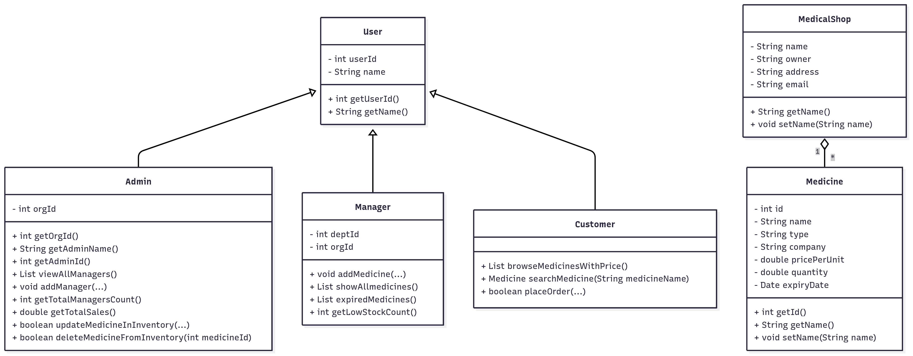
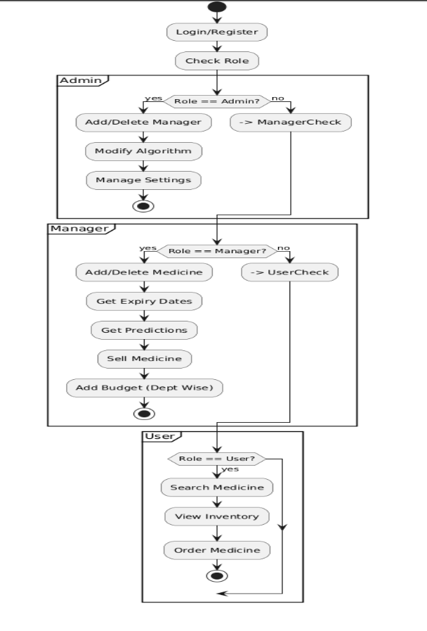
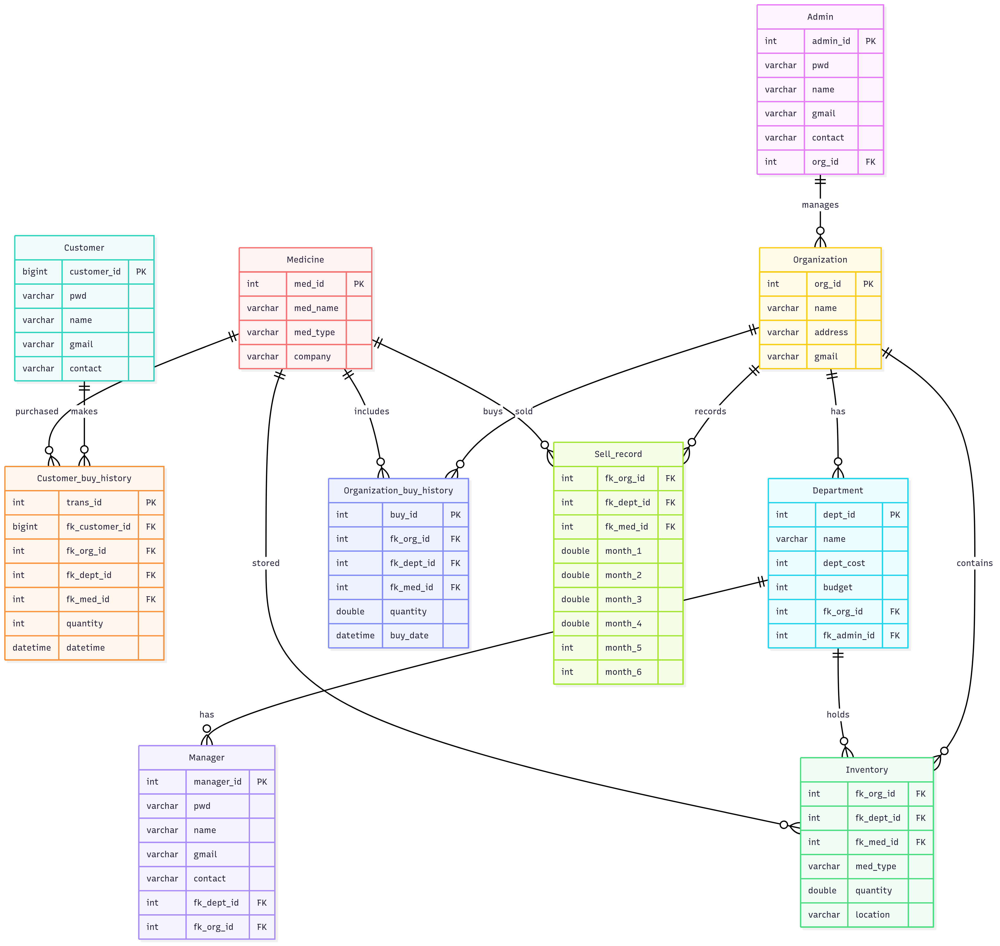

# 🏥 MediStock Plus — Smart Medical Inventory & E-Commerce Platform

[]()
[]()
[]()
[]()
[]()

---

## 📌 Overview
**MediStock Plus** is a **JavaFX-based Smart Medical Inventory & E-Commerce Platform** designed to simplify **medicine management, inventory control, and online ordering** for **pharmacies, hospitals, and customers**.  

💊 **Customers** can search, compare, and order medicines online.  
🏪 **Managers** can **manage stock**, **track expiry dates**, **predict demand**, and **allocate budgets**.  
⚡ **Admins** control managers, configure prediction algorithms, and oversee the entire system.

---

## 🚀 Key Features

### 👨‍⚕️ **For Customers**
- 🧾 Secure **account registration & login**
- 🔍 **Medicine search** across stores
- 🛒 **E-commerce ordering** from verified sellers
- 📦 **Order tracking** & inventory browsing

### 🏪 **For Managers**
- ➕ Add / ❌ delete medicines  
- ⏳ **Expiry alerts** for near-expiry products  
- 📊 **Demand prediction** using past 6 months’ sales data  
- 🧮 **Department-wise budget allocation**  
- 🛍 **Sales management** directly from the app  

### 🛡 **For Admins**
- 👥 Create & delete **manager accounts**
- ⚙ Modify the **prediction algorithm**
- 🔧 Configure overall **system settings**

---

## 🤖 Intelligent & Automated Features
- **📦 Auto Stocking** — Automatically assigns storage locations for large inventories  
- **🔔 Smart Alerts** — Expiry & low-stock reminders  
- **📈 Demand Forecasting** — Predicts future demand to avoid shortages or overstocking  
- **🔐 Role-Based Security** — Encrypted login & access control  

---

## 🛠 Technology Stack

| **Layer**        | **Technology**     |
|-------------------|---------------------|
| **Frontend**      | JavaFX (Java GUI)   |
| **Backend**       | Java (Core Logic, Prediction Engine) |
| **Database**      | SQL-Based Relational DB |
| **Security**      | Password encryption, role-based access control |
| **Platform**      | Desktop Application |
| **Java Version**  | JDK **17** (recommended) |
| **JavaFX Version**| **17+** |

---

## 📂 Functional Modules

| **Role**      | **Key Features** |
|--------------|-------------------|
| **Customer** | Account creation, login, search medicines, view inventory, place orders |
| **Manager**  | Manage medicines, expiry tracking, predictions, sell medicines, budget allocation |
| **Admin**    | Manage managers, update prediction settings, configure system |

---

## 🧩 System Design & Diagrams

### **Use Case Diagram**


### **Class Diagram**


### **Activity Diagram**


### **ER Diagram**


---

## ⚡ How to Set Up & Run the Project

Follow these steps carefully to set up and run **MediStock Plus** on your local machine.

---

### **1️⃣ Prerequisites**
Before running the project, ensure you have the following installed:
- **Java JDK 17 or higher** → [Download Here](https://jdk.java.net/17/)
- **JavaFX SDK 17+** → [Download Here](https://gluonhq.com/products/javafx/)
- **MySQL / MariaDB** (or any SQL-based DB)
- **IntelliJ IDEA** / **Eclipse** / **NetBeans**

---

### **2️⃣ Clone the Repository**
```bash
git clone https://github.com/your-username/MediStockPlus.git
cd MediStockPlus

### **2️⃣ Clone the Repository**
```bash
git clone https://github.com/your-username/MediStockPlus.git
cd MediStockPlus
3️⃣ Set Up the Database
Open MySQL or MariaDB

Create a new database:

sql
CREATE DATABASE medistock_db;
Import the provided medistock.sql file from the database/ folder.

4️⃣ Configure Database Credentials
Navigate to: src/main/resources/db_config.properties

Update the database details:

text
db.url=jdbc:mysql://localhost:3306/medistock_db
db.username=your_username
db.password=your_password
5️⃣ Configure JavaFX in IDE
For IntelliJ IDEA:

Go to File → Project Structure → Libraries → Add JavaFX SDK

Add the lib folder from your downloaded JavaFX SDK

In Run/Debug Configurations → VM Options, add:

text
--module-path "path_to_javafx_sdk/lib" --add-modules javafx.controls,javafx.fxml
6️⃣ Build & Run
Open the project in your IDE

Make sure JDK 17 and JavaFX 17 SDK are correctly configured

Run the Main.java file:

bash
javac --module-path "path_to_javafx_sdk/lib" --add-modules javafx.controls,javafx.fxml Main.java
java --module-path "path_to_javafx_sdk/lib" --add-modules javafx.controls,javafx.fxml Main
🏆 Conclusion
MediStock Plus combines e-commerce and smart inventory management into one secure, predictive, and user-friendly healthcare solution.
It saves costs, reduces wastage, and makes medicine management seamless for customers, managers, and admins.

📬 Contact
📧 Kawser Ahmmed — [your_email@example.com]
🔗 LinkedIn • GitHub

text


