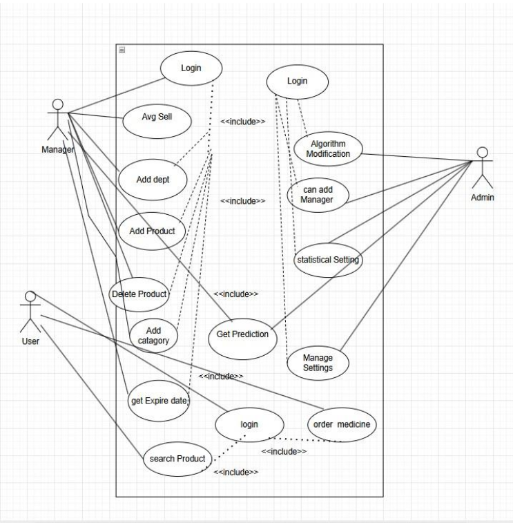

# MediStock Pro — Smart Medical Inventory & E-Commerce Platform

## 📌 Overview
**MediStock Pro** is a **JavaFX-based smart medical inventory and e-commerce system** that enables **pharmacies, hospitals, and other healthcare organizations** to manage medicine stocks, predict demand, avoid losses due to expiry, and sell to customers online.  
Customers can purchase medicines from multiple stores, while managers and admins can efficiently control inventory using intelligent predictions.

---

## 🚀 Key Features

### **For Customers**
- Create an account / login securely
- Search and check medicine availability across stores
- View various medical inventories and product details
- Order medicines from multiple registered sellers

### **For Managers**
- Add and delete medicines
- View expiry dates and receive expiry alerts
- Get AI-based **medicine demand predictions**
- Sell medicines directly
- Manage departments/categories and allocate budgets
- View average sales and stock suggestions

### **For Admins**
- Create and manage multiple manager accounts
- Add or remove managers
- Modify and update the **prediction algorithm**
- Adjust system settings for better performance

---

## 🧠 Intelligent & Automated Features
- **Auto Stocking** — Large inventories automatically store medicines with location mapping
- **Smart Alerts** — Notifications for expiry and low stock based on sales patterns
- **Statistical Predictions** — Helps managers avoid overstocking or running out of medicines

---

## 🔒 Security & Reliability
- Role-based access control (Admin, Manager, Customer)
- Password encryption and secure login
- Automatic session logout after inactivity
- 24/7 availability with backup & recovery support

---

## ⚙️ Technology Stack
- **Platform:** Desktop Application
- **Framework:** JavaFX
- **Database:** SQL-based (with future API integration for barcode scanners and warehouse systems)

---

## 📂 Functional Modules

| Role       | Features |
|------------|----------|
| **Customer** | Account creation, login, search medicines, view inventory, place orders |
| **Manager**  | Add/delete medicines, manage expiry, predictions, sell medicines, allocate budgets |
| **Admin**    | Create/delete managers, update prediction settings, manage system configuration |

---

## 📊 System Design

### **Use Case Diagram**

### **Class Diagram**

### **Activity Diagram**

---

## 📈 Future Enhancements
- Integration with **mobile app** for real-time access
- API support for warehouse management systems
- Barcode scanner integration for faster stock updates

---

## 🏷 Suggested Tags
`javafx` `inventory-management` `medical-software` `ecommerce` `pharmacy-management` `java` `healthcare` `medicine`
