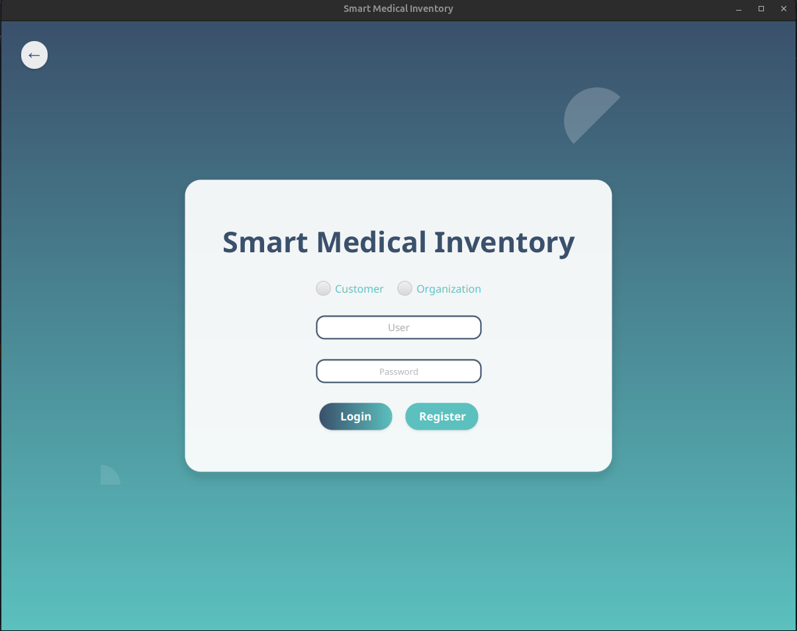
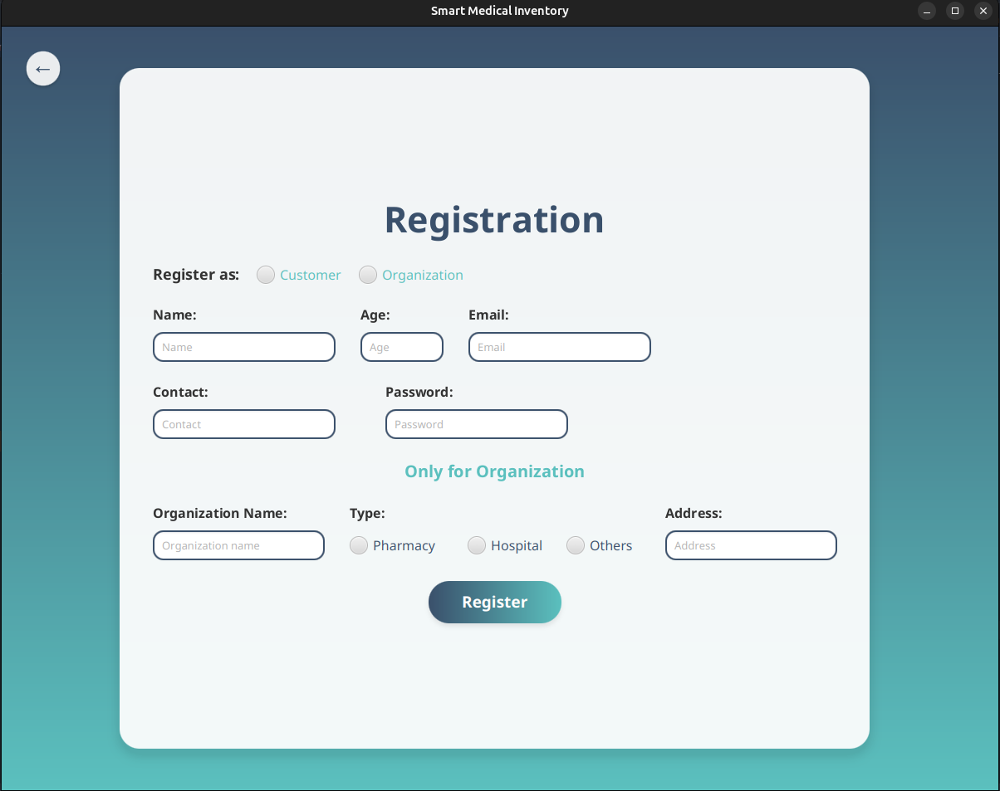
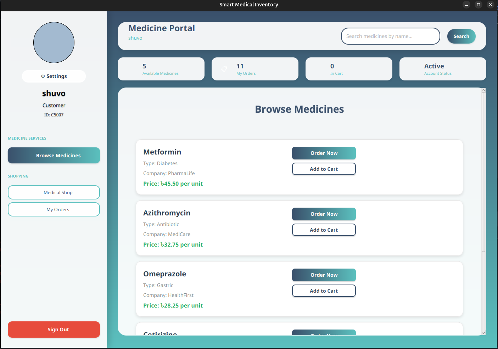
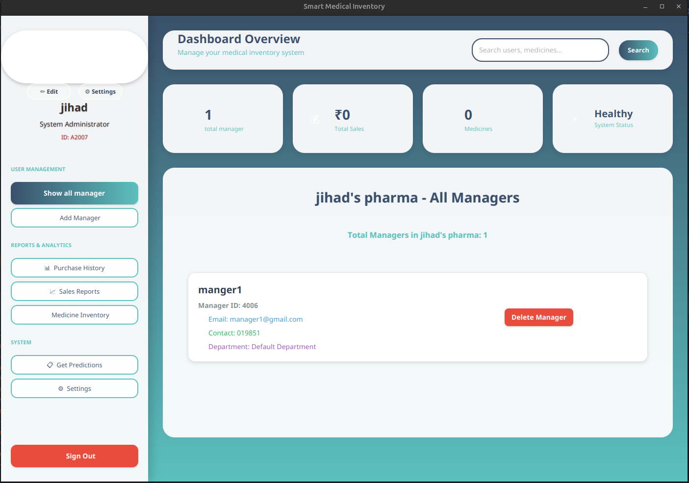
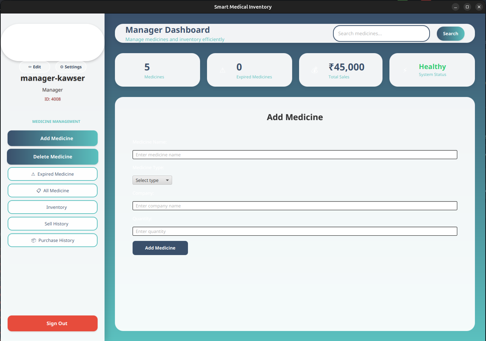

# 🏥 MediStock Plus — Smart Medical Inventory & E-Commerce Platform

---

##  Overview
**MediStock Plus** is a **JavaFX-based Smart Medical Inventory & E-Commerce Platform** designed to simplify **medicine management, inventory control, and online ordering** for **pharmacies, hospitals, and customers**.  

**Customers** can search, compare, and order medicines online.  
 **Managers** can **manage stock**, **track expiry dates**, **predict demand**, and **allocate budgets**.  
⚡ **Admins** control managers, configure prediction algorithms, and oversee the entire system.

---

##  Key Features

###  **For Customers**
-  Secure **account registration & login**
-  **Medicine search** across stores
-  **E-commerce ordering** from verified sellers
-  **Order tracking** & inventory browsing

###  **For Managers**
- ➕ Add / ❌ delete medicines  
-  **Expiry alerts** for near-expiry products  
-  **Demand prediction** using past 6 months’ sales data  
-  **Department-wise budget allocation**  
-  **Sales management** directly from the app  

###  **For Admins**
-  Create & delete **manager accounts**
-  Modify the **prediction algorithm**
-  Configure overall **system settings**

---

## 🤖 Intelligent & Automated Features
- ** Auto Stocking** — Automatically assigns storage locations for large inventories  
- ** Smart Alerts** — Expiry & low-stock reminders  
- ** Demand Forecasting** — Predicts future demand to avoid shortages or overstocking  
- ** Role-Based Security** — Encrypted login & access control  

---

## 🛠 Technology Stack

| **Layer**        | **Technology**     |
|-------------------|---------------------|
| **Frontend**      | JavaFX (Java GUI)   |
| **Backend**       | Java (Core Logic, Prediction Engine) |
| **Database**      | SQL-Based Relational DB |
| **Security**      | Password encryption, role-based access control |
| **Platform**      | Desktop Application |
| **Java Version**  | JDK **17** (recommended) |
| **JavaFX Version**| **17+** |

---

##  Functional Modules

| **Role**      | **Key Features** |
|--------------|-------------------|
| **Customer** | Account creation, login, search medicines, view inventory, place orders |
| **Manager**  | Manage medicines, expiry tracking, predictions, sell medicines, budget allocation |
| **Admin**    | Manage managers, update prediction settings, configure system |

---

## 🧩 System Design & Diagrams

### **Use Case Diagram**

### **Class Diagram**

### **Activity Diagram**

### **ER Diagram**

---

### ** Prerequisites**
Before running the project, ensure you have the following installed:
- **Java JDK 17 or higher** → [Download Here](https://jdk.java.net/17/)
- **JavaFX SDK 17+** → [Download Here](https://gluonhq.com/products/javafx/)
- **MySQL / MariaDB** (or any SQL-based DB)
- **IntelliJ IDEA** / **Eclipse** / **NetBeans**

### ** Screenshots**
### **LOGIN PAGE**

### **REGISTRATION PAGE**

### **CUSTOMER DASHBORD**

### **MANAGER DASHBORD**

### **MANAGER DASHBORD**

Conclusion
MediStock Plus combines e-commerce and smart inventory management into one secure, predictive, and user-friendly healthcare solution.
It saves costs, reduces wastage, and makes medicine management seamless for customers, managers, and admins.

 Contact
 Kawser Ahmmed — [mkshuvo25350@gmail.com]
- 🔗 LinkedIn • (https://www.linkedin.com/in/kawser-ahmmed-6a0b65267/)

